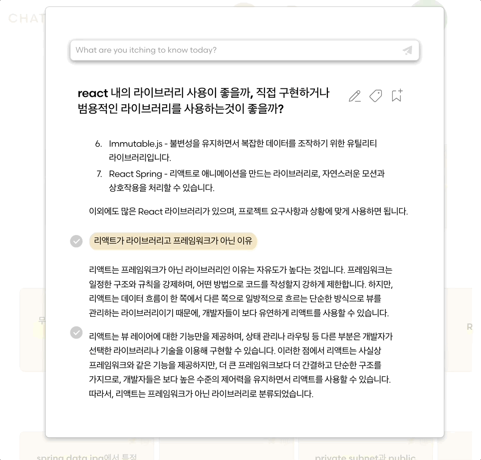

 
 <h3 align="center">Team Bug Fetish Presents..   
 </h3>

ChatGPT 대화 검색, 북마킹 및 태깅 서비스

장성아(팀장), 맹승주, 박지원, 순정원, 김민수, 한재영

 <a href="http://chatcrawl.live">Live Demo Link</a>   
 <a href="https://www.notion.so/codestates/ChatCrawl-Service-Manual-cffba157c8cb4883b1f23b80d7ec771a">Service Manual</a>

 
  
<h2 align='center'>핵심 기능</h2>

- ChatGPT 처럼 대화세션을 생성하여 질문을 이어서 할 수 있음

- 생성된 대화세션은 히스토리페이지에서 최신활동순, 활동량순, 오래된순으로 전부 조회 가능

 
→ 원하는 대화만 페이지 상단에 고정 및 즉시 조회

 
→ 질문답변 내용, 태그 검색으로 빠르게 필요한 대화 찾기

- 원하는 대화만 태그를 추가하거나 북마크하여 컬렉션페이지에서 관리

→ 보고 싶은 답변만 선택 조회 

→ 전답변들 감춰진 상태로 대화 계속 이어서 하기 

 
 

<h3 align='center'>확장 가능성</h3>
 

- 대화 중 원하는 부분만 하이라이트, 선택 저장

- AI를 통한 대화세션 내용 자동 요약

- 공식 ChatGPT 대화 데이터를 import해서 관리 및 대화 지속 

- 공개게시판 기능 (본인 대화 공개 게시, 타인 게시 대화목록 조회, 채택 및 저장)

- 인공지능 성격 부여, 원하는 인공지능 캐릭터와 대화 (더 원하는 대답을 얻을 수 있도록 scaffolding)

- 여러 태그 (AND/OR) 검색, 해당 북마크 내 태그 검색 등

 
 
<h2 align='center'>Team Bug Fetish</h2>

| 장성아 (FE 팀장) | 박지원 (FE) | 맹승주 (FE) | 순정원 (BE 팀장) | 김민수 (BE) | 한재영 (BE) |
| :---: | :---: | :---: | :---: |  :---: | :---: |
|   |  | | |  |  |
| [@splazt](https://github.com/splazt) |   [@zi0ne](https://github.com/zi0ne) |  [@mmmkb1](https://github.com/mmmkb1) | [@sundae95](https://github.com/sundae95) | [@mslock](https://github.com/mslock) | [@splo-sh](https://github.com/splo-sh) |
|
- UI 디자인 Lead - 상단 내비게이션 - 메인 + 히스토리   - 북마킹, 태깅, 고정  - 대화 조회, 지속  - 컬렉션 페이지  - 통합 상태 관리 - 유효성 검사 강화 - 자동배포 환경 구축   
|
- 회원가입 - 로그인 인증 - 마이페이지 - OAuth 로그인 - 소개 페이지 - 히스토리 초안 
|
- 컬렉션 초안 - 저장목록 조회  - 북마크별 조회  - 답변 토글 
| 
- 배포환경 구축  - 태그 초안   
|
- 회원가입 기능 - 로그인 기능  - 보안 기능 
|
- 히스토리 조회, 검색  - 북마크, 태그별 조회  - 북마킹, 태깅, 고정 - 대화세션 생성, 지속 
|

 
 

<h2 align='center'>Demo Peek</h2>

|  |
| :---: |

<h2 align='center'>  Core Features</h2>

|소개페이지|회원가입 / 로그인|
|:---:|:---:|
|||
|AI와의 기본 대화 |제목 수정|
|||
|대화 북마킹 & 태깅|대화 내용 및 태그 검색|
|||
|히스토리 정렬 |원하는 대화 고정, 삭제|
|||
|북마크 조회 & 생성 | 선택 답변만 조회 |
|||
| 원하는 대화 계속하기 | 캐릭터, 아이디 변경 |
|||

<h2 align='center'> UI Design & User Flow </h2>

| User flow |
| :---: |
|  |

| Figma |
| :---: |
|  |
|  | 
|  | 
     

<h2 align='center'> Tech Stack & Tools</h2>

| Git | Github | Discord |
| :---: | :---: | :---: |
|  |  |  |
### Front-end
| HTML5 | TypeScript | React | Styled Components | Redux-Toolkit | Axios | ESLint | Prettier | Figma | Vite | 
| :---: | :---: | :---: | :---: | :---: | :---: | :---: | :---: | :---: | :---: |
|  | 

 | 

 |  | 

 |   |  

 | 

 |  | 

### Back-end
| Java | mySQL | AWS | Spring | Spring Boot | Spring Security | 
| :---: | :---: | :---: | :---: | :---: | :---: |
| 

 | 

 | 

 |  |  |  |
 

<h2 align='center'>  Git Convention </h2>

<h3 align='center'>Branch</h3>

<code>dev</code> : 배포 가능한 상태 관리 브랜치 (<code>be-dev</code> + <code>fe-dev</code> ) 

<code>be-dev</code> : BE 개발 통합 브랜치 (기능 구현 완성할 할때마다 테스트 후 merge한다) 

<code>fe-dev</code> : FE 개발 통합 브랜치 (기능 구현 완성할 할때마다 테스트 후 merge한다) 

<code>be-feat/[feature-name]</code>  : BE 기능 개발 브랜치

<code>fe-feat/[feature-name]</code> : FE 기능 개발 브랜치

<code>hotfix</code> : 출시 버전에서 발생하는 버그 수정 브랜치 (긴급 수정용)

 
<h3 align='center'> Commit Convention </h3>

- <code>Feat</code> : 새로운 기능 추가 

 
- <code>Fix</code> : 버그 수정 

 
- <code>Docs</code> : 문서 수정 

- <code>Style</code> : 코드 포맷팅, 세미콜론 누락, 코드 변경이 없는 경우 

- <code>Refactor</code> : 코드 리펙토링 

- <code>Test</code> : 테스트 코드, 리펙토링 테스트 코드 추가 

- <code>Remove </code>: 불필요한 파일/폴더 삭제 

- <code>Rename</code>: 파일, 폴더명 수정 

- <code>Chore</code>: 빌드 업무 수정, 패키지 매니저 수정 

